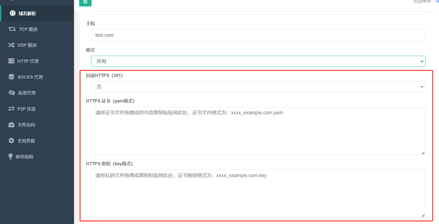

# NPS

[README](https://github.com/zhangsean/nps/blob/master/README.md)|[中文文档](https://github.com/zhangsean/nps/blob/master/README_zh.md)

# 说明
由于nps已经有二年多的时间没有更新了，存留了不少bug和未完善的功能。

此版本基于 nps 0.26.10的基础上二次开发而来。

***DockerHub***： [NPS](https://hub.docker.com/r/zhangsean/nps) [NPC](https://hub.docker.com/r/zhangsean/npc)

# 交流群
聊天灌水QQ群：770569342,619833483(已满)

# 公益云内网穿透
https://natnps.com/
公益NPS内网穿透服务，长期免费，6M带宽，3条隧道，不限流量，欢迎来嫖，自行注册账号。

# 特价云服务器
国内BGP，游戏开服，2核 2G 15M上行 25元/月，[专属连接，首月5折](https://www.rainyun.com/MjY0MzY1_)

# 捐赠

## 更新日志
- 2026-07-07  v0.27.14
  - **新增**：`npc` 支持通过 `-cip`、环境变量 `NPC_CIP` 或 `npc.conf` 的 `cip` 手动上报客户端展示 IP，便于 Docker/gost 转发场景在服务端客户端列表显示公网 IP。
  - **新增**：客户端列表支持在公网 IP 后显示归属地，并增加内存缓存、失败短缓存和第三方接口限流暂停，避免频繁调用 IP 归属地接口。

- 2026-07-03  v0.27.13
  - **修复**：修复客户端列表、隧道列表、域名列表中模板 JS 拼接导致的浏览器语法错误，避免列表页无法正常渲染。
  - **优化**：统一内联 JS 中 `web_base_url`、`bridge_type` 等模板变量的字符串渲染方式，降低后续模板解析风险。
  - **优化**：减少 HTTPS 连接相关的噪声日志。

- 2026-06-30  v0.27.12
  - **修复**：修复 nps mux 接收队列可能空转导致资源占用异常的问题。
  - **优化**：优化镜像体积与构建流程，增加前端资源压缩和二进制压缩。
  - **优化**：更新默认配置项和默认值。
  - **CI**：修复发布流程中的 Go 模板压缩处理、废弃 `go get` 用法和 Docker 镜像预构建流程。

- 2026-05-27  v0.27.11
  - **优化**：改进端口选择逻辑，返回更合理的可用端口结果。
  - **优化**：优化列表展示与搜索功能，并补充时间单位翻译。

- 2026-05-07  v0.27.9
  - **新增**：添加端口选择器功能，包含前端界面和后端逻辑。
  - **CI**：升级 GitHub Actions 相关版本，优化构建和发布流程。
  - **CI**：修复 Dockerfile 中 `entrypoint.sh` 可执行权限问题。
  - **CI**：优化 spk 构建流程，添加本地分发包生成和处理逻辑。
  - **CI**：重构 GitHub Release 创建流程，并改进 GitHub CLI 安装方式。

- 2024-10-27  v0.26.21
  - **特性**：Http和TCP代理支持克隆功能，方便快捷复制代理
  - **特性**：相同客户端的Http和TCP代理列表便捷切换
  - **特性**：NPS默认启动一个本地代理客户端，不需要额外启动客户端，即可象 Nginx 一样配置Http和TCP代理，这个本地代理模式有配置界面还实时生效比 Nginx 更方便

- 2024-06-01  v0.26.19
  - golang 版本升级到 1.22.
  - 增加自动https，自动将http 重定向（301）到 https.
  - 客户端命令行方式启动支持多个隧道ID，使用逗号拼接，示例：`npc -server=xxx:8024 -vkey=ytkpyr0er676m0r7,iwnbjfbvygvzyzzt` .
  - 移除 nps.conf 参数 `https_just_proxy` , 调整 https 处理逻辑，如果上传了 https 证书，则由nps负责SSL (此方式可以获取真实IP)，
      否则走端口转发模式（使用本地证书,nps 获取不到真实IP）， 如下图所示。
    

- 2024-02-27  v0.26.18
  ***新增***：nps.conf 新增 `tls_bridge_port=8025` 参数，当 `tls_enable=true` 时，nps 会监听8025端口，作为 tls 的连接端口。
             客户端可以选择连接 tls 端口或者非 tls 端口： `npc.exe  -server=xxx:8024 -vkey=xxx` 或 `npc.exe  -server=xxx:8025 -vkey=xxx -tls_enable=true`

- 2024-01-31  v0.26.17
  ***说明***：考虑到 npc 历史版本客户端众多，版本号不同旧版本客户端无法连接，为了兼容，仓库版本号将继续沿用 0.26.xx

- 2024-01-02  v0.27.01  (已作废，功能移动到v0.26.17 版本)
  ***新增***：tls 流量加密，(客户端忽略证书校验，谨慎使用，客户端与服务端需要同时开启，或同时关闭)，使用方式：
             服务端：nps.conf `tls_enable=true`;
             客户端：npc.conf `tls_enable=true` 或者 `npc.exe  -server=xxx -vkey=xxx -tls_enable=true`

- 2023-06-01  v0.26.16
  ***修复***：https 流量不统计 Bug 修复。
  ***新增***：新增全局黑名单IP，用于防止被肉鸡扫描端口或被恶意攻击。
  ***新增***：新增客户端上次在线时间。

- 2023-02-24  v0.26.15
  ***修复***：更新程序 url 更改到当前仓库中
  ***修复***：nps 在外部路径启动时找不到配置文件
  ***新增***：增加 nps 启动参数，`-conf_path=D:\test\nps`,可用于加载指定nps配置文件和web文件目录。
  ***window 使用示例：***
  直接启动：`nps.exe -conf_path=D:\test\nps`
  安装：`nps.exe install -conf_path=D:\test\nps`
  安装启动：`nps.exe start`

  ***linux 使用示例：***
  直接启动：`./nps -conf_path=/app/nps`
  安装：`./nps install -conf_path=/app/nps`
  安装启动：`nps start -conf_path=/app/nps`

- 2022-12-30  v0.26.14
  ***修复***：API 鉴权漏洞修复

- 2022-12-19
***修复***：某些场景下丢包导致服务端意外退出
***优化***：新增隧道时，不指定服务端口时，将自动生成端口号
***优化***：API返回ID, `/client/add/, /index/addhost/，/index/add/ `
***优化***：域名解析、隧道页面，增加[唯一验证密钥]，方便搜查

- 2022-10-30
***新增***：在管理面板中新增客户端时，可以配置多个黑名单IP，用于防止被肉鸡扫描端口或被恶意攻击。
***优化***：0.26.12 版本还原了注册系统功能，使用方式和以前一样。无论是否注册了系统服务，直接执行 nps 时只会读取当前目录下的配置文件。

- 2022-10-27
***新增***：在管理面板登录时开启验证码校验，开启方式：nps.conf `open_captcha=true`，感谢 [@dongFangTuring](https://github.com/dongFangTuring) 提供的PR

- 2022-10-24:
***修复***：HTTP协议支持WebSocket(稳定性待测试)

- 2022-10-21:
***修复***：HTTP协议下实时统计流量，能够精准的限制住流量（上下行对等）
***优化***：删除HTTP隧道时，客户端已用流量不再清空

- 2022-10-19:
***BUG***：在TCP协议下，流量统计有问题，只有当连接断开时才会统计流量。例如，限制客户端流量20m,当传输100m的文件时，也能传输成功。
***修复***：TCP协议下实时统计流量，能够精准的限制住流量（上下行对等）
***优化***：删除TCP隧道时，客户端已用流量不再清空

- 2022-09-14:
修改NPS工作目录为当前可执行文件目录（即配置文件和nps可执行文件放在同一目录下，直接执行nps文件即可），去除注册系统服务，启动、停止、升级等命令
